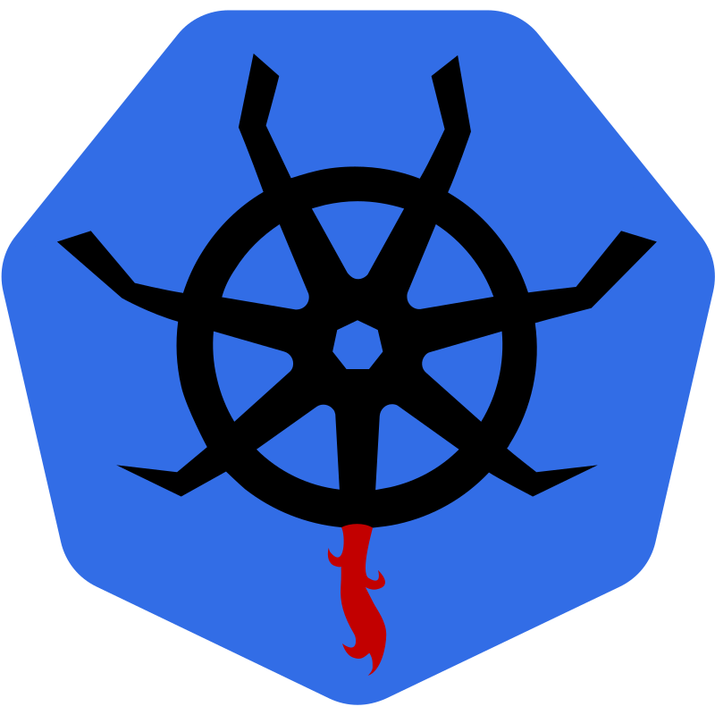
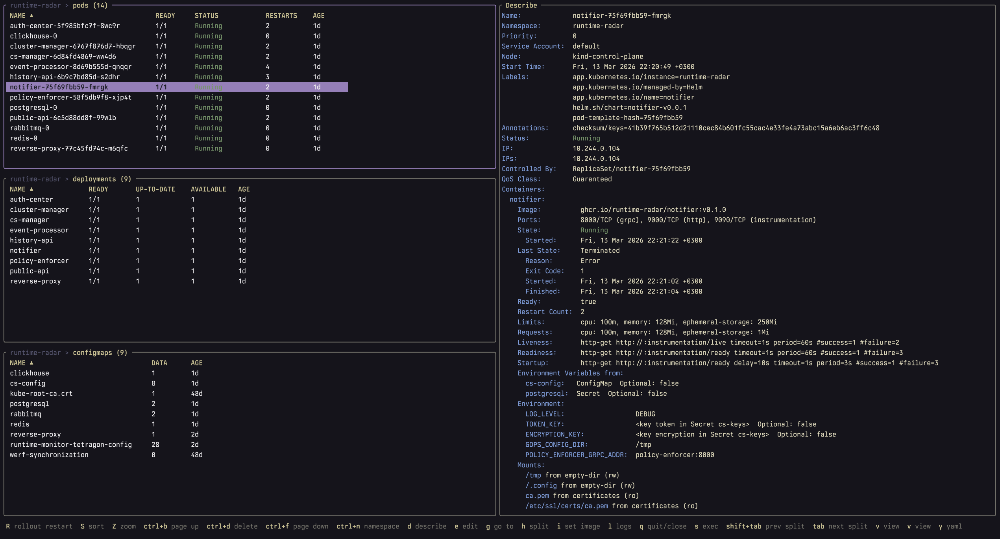

# aku

<p align="center">
  
</p>

**A**nother **K**8s **U**I

A terminal UI for managing Kubernetes clusters, built with [Bubble Tea](https://github.com/charmbracelet/bubbletea).

<p align="center">
  
</p>

## Features

**Resource browsing**
- Automatic discovery of any CRD or API resource not covered by built-in plugins
- Disambiguation of same-name resources across API groups (e.g. `certificates [cert-manager.io/v1]`)
- Helm release management with values editing, rollback, and chart switching
- Drill-down navigation between related resources (deployment → replicaset → pods → containers)

**Views**
- YAML view with syntax highlighting (managedFields stripped)
- Describe view with events and environment variable resolution
- Live log streaming with time range presets, container selection, and autoscroll
- Log syntax highlighting (JSON, log levels, IPs, URLs, UUIDs, timestamps, paths, key=value)
- Split panes with independent namespace, filter, and cursor per pane
- Zoom to full-screen any split or detail panel

**Operations**
- Edit resources in your `$EDITOR` with automatic retry on validation errors
- Exec into containers
- Ephemeral debug containers (pods and nodes, with optional privileged mode)
- Port forwarding with live status tracking
- Update container images across workloads
- Scale deployments, statefulsets, and replicasets
- Rollout restart for deployments and pods
- Multi-select resources for bulk delete
- Helm values editing, rollback to any revision, and chart reference updates

**Navigation**
- Vim-style keybindings with multi-key sequences (`gg`, `gp`, `gd`, etc.)
- Fuzzy resource picker (`:`) and namespace picker (`Ctrl+n`)
- Regex search (`/`) and filter (`Ctrl+/`) in both list and detail views
- Column sorting by name, namespace, age, status, or kind
- Fully customizable keybindings via YAML

## Installation

### From GitHub releases

Download a prebuilt binary from the [releases page](https://github.com/aohoyd/aku/releases).

### From source

```bash
go install github.com/aohoyd/aku@latest
```

### Build locally

```bash
git clone https://github.com/aohoyd/aku.git
cd aku
make build
```

## Usage

```bash
aku                                    # default kubeconfig and context
aku --context staging                  # specific context
aku -n kube-system                     # specific namespace
aku -r pods,deploy                     # open with specific resources
aku -r pods -d logs                    # open pods with log panel
aku -r certificates.cert-manager.io/v1 # qualified resource (when names collide)
aku --kubeconfig /path/to/kubeconfig   # custom kubeconfig path
```

| Flag | Short | Description |
|------|-------|-------------|
| `--kubeconfig` | | Path to kubeconfig file |
| `--context` | | Kubeconfig context to use |
| `--namespace` | `-n` | Kubernetes namespace |
| `--resource` | `-r` | Resources to display (repeatable) |
| `--details` | `-d` | Open detail panel (`y`/yaml, `d`/describe, `l`/logs) |

aku reads your kubeconfig from `$KUBECONFIG` or `~/.kube/config`.

## Configuration

All configuration files are optional. aku uses sensible defaults when no config files are present.

```
~/.config/aku/
├── config.yaml    # Application settings
├── keymap.yaml    # Custom keybindings
└── theme.yaml     # Color theme
```

The directory follows the XDG Base Directory specification (`$XDG_CONFIG_HOME/aku/`).

### config.yaml

```yaml
# Helm chart references for values editing
charts:
  my-namespace:
    my-release: oci://registry.example.com/charts/my-chart

# Debug container settings
debug:
  image: busybox:latest    # default
  command: ["sh"]          # default

# Log viewer settings
logs:
  buffer_size: 10000       # max lines to buffer (default)

# API timeout for async operations (describe, helm, log stream)
api:
  timeout_seconds: 5       # default
  heartbeat_seconds: 5     # cluster health check interval (default)
```

### keymap.yaml

```yaml
bindings:
  # Add a custom binding
  - key: "ctrl+l"
    help: "logs"
    command: "view-logs-focused"
    scope: "resources"
    for: ["pods"]
    visible: true

  # Multi-key sequence
  - key: "g"
    scope: "resources"
    keys:
      - key: "i"
        help: "ingresses"
        command: "goto-ingresses"
```

Available scopes: `resources`, `details` (matches all detail views), `yaml`, `describe`, `logs`.

### theme.yaml

```yaml
ui:
  accent: "#7C3AED"
  muted: "#6B7280"
  error: "#EF4444"
  warning: "#F59E0B"

status:
  running: "#10B981"
  failed: "#EF4444"
  pending: "#F59E0B"

syntax:
  key: "#60A5FA"
  string: "#34D399"
  number: "#F472B6"
```

## Key Bindings

### Global

| Key | Action |
|-----|--------|
| `q` | Quit / close overlay |
| `Ctrl+n` | Namespace picker |
| `:` | Resource picker |
| `?` | Help overlay |
| `y` | YAML view |
| `d` | Describe view |
| `e` | Edit resource |
| `Z` | Toggle zoom |
| `Ctrl+r` | Reload all |
| `/` | Search (regex) |
| `\|` / `Ctrl+/` | Filter (regex) |

### Resource List

| Key | Action |
|-----|--------|
| `j/k` | Cursor up/down |
| `gg` / `G` | Top / bottom |
| `Enter` | Drill down / open detail |
| `Tab` / `Shift+Tab` | Next / prev split pane |
| `Space` | Toggle select |
| `Ctrl+a` | Select all |
| `Ctrl+d` | Delete selected |
| `g + p/d/s/v/c/n` | Go to pods/deployments/secrets/services/configmaps/namespaces |
| `h + p/d/s/v/c` | Open split: pods/deployments/secrets/services/configmaps |
| `S + n/N/a/s` | Sort by name/namespace/age/status |

### Detail Panel

| Key | Action |
|-----|--------|
| `h` / `Left` | Back to list |
| `w` | Toggle word wrap |
| `H/L` | Scroll left/right |
| `x` | Resolve env variables |
| `r` | Refresh |

### Logs View

| Key | Action |
|-----|--------|
| `a` | Toggle autoscroll |
| `s` | Toggle syntax highlighting |
| `c` | Select container |
| `t` | Time range |
| `Enter` | Insert marker |

### Resource-Specific

| Key | Resource | Action |
|-----|----------|--------|
| `l` | Pods, Containers | View logs |
| `s` | Deployments, StatefulSets, ReplicaSets | Scale replicas |
| `i` | Pods, Deployments, StatefulSets, DaemonSets | Set image |
| `R` | Deployments, Pods | Rollout restart |
| `R` | Helm releases | Rollback |
| `C` | Helm releases | Set chart |
| `pf` | Pods, Containers | Port forward |
| `ss` | Pods, Containers | Exec |
| `sd` | Pods, Containers, Nodes | Debug container |
| `sp` | Pods, Containers, Nodes | Privileged debug |

## Name

The name is a reference to [Aku](https://en.wikipedia.org/wiki/Aku_(Samurai_Jack)) from Samurai Jack — and also stands for **A**nother **K**8s **U**I.

## License

MIT
